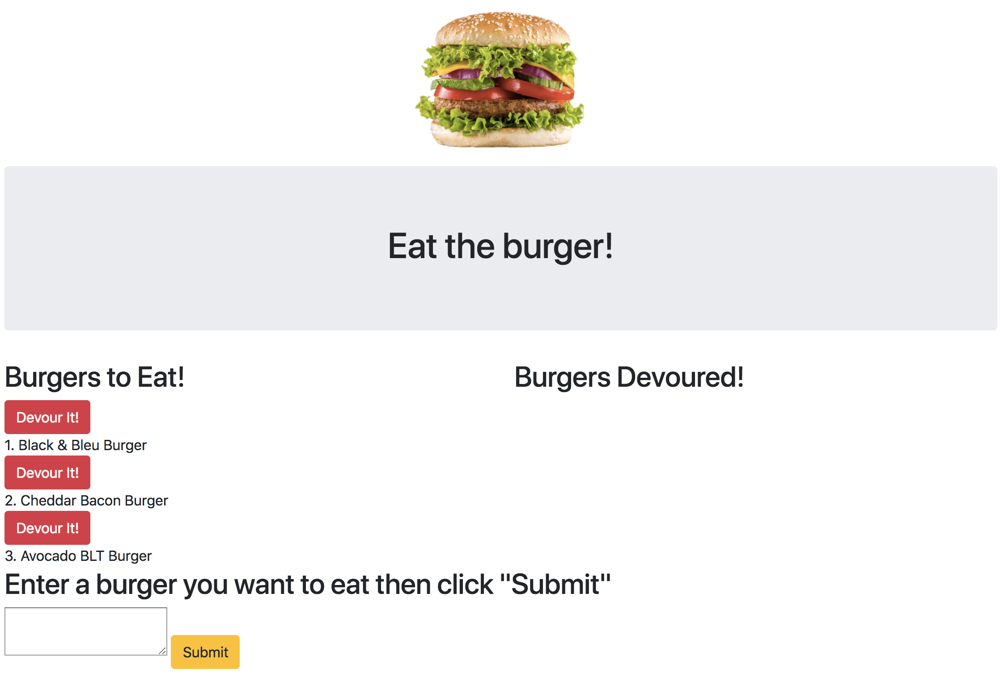

## Eat the Burger!

Created during Week 14 of UNH Coding Bootcamp. The goal was to create a Burger App using Node Express Handlebars and our own ORM. It uses the MVC design pattern, Node and MySQL to query and route data to the app and Handlebars to generate the HTML.

## Getting Started
https://powerful-chamber-99113.herokuapp.com/


## Screen Shots


Index Page


## Technologies used
- Node.js
- MySQL
- Handlebars - http://handlebarsjs.com/
- body-parser NPM Package - https://www.npmjs.com/package/inquirer
- express NPM Package - https://www.npmjs.com/package/express
- mysql NPM Package - https://www.npmjs.com/package/mysql
- handlebars NPM Package - https://www.npmjs.com/package/handlebars
- express-handlbars NPM Package - https://www.npmjs.com/package/express-handlebars

### Prerequisites

```
- Node.js - Download the latest version of Node https://nodejs.org/en/
- Bootstrap - Add CDN link http://getbootstrap.com/getting-started.html
```

## Built With

* Sublime Text - Text Editor
* Bootstrap - Wireframe
* Sequel Pro

## Authors

* **Mary Doucet** - *JS/Node.js/Handlebars* - [Mary Doucet](https://github.com/medoucet720)